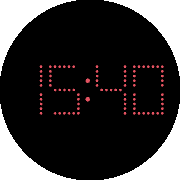

# pulsar-watchface
A watchface for the Pebble Time Round which imitates a Pulsar LED watch.

## Dependencies
- pebble-clay
- pebble-fctx

## Installation

### Installing with the Pebble SDK
Once you have the Pebble SDK installed, you can compile and install this app.

Before attempting any one of these actions, insure that you are in the parent directory of the project within your terminal program.

`pebble build`

This command will compile the project. If you are having any troubles or a previously compiled build needs to be removed, you can run `pebble clean` before building.

`pebble install --phone <IP ADDR>`

In order to install the app onto your pebble smartwatch, you will need to enable a developer connection to your watch through the pebble smartphone app. Details can be found [here](https://developer.pebble.com/guides/tools-and-resources/developer-connection/).

You can also run the app in the emulator that comes with the Pebble SDK by executing this command `pebble install --emulator <EMULATOR>`. You will need to enter in the type of watch that you desire to emulate. The available emulators are "aplite" for Classic/Steel, "basalt" for Time/Time Steel, "chalk" for Time Round, "diorite" for Pebble 2, and "emery" for Time 2. This app has been developed to support most, if not all, pebble watch configurations. For instance, in order to run the "chalk" emulator, the command would be `pebble install --emulator chalk`. More information on the specifics of each hardware platform can be found [here](https://developer.pebble.com/guides/tools-and-resources/hardware-information/).

### Installing with the Pre-compiled Package
First, you will need to transfer the `build/pulsar-watchface.pbw` file into an accessible directory on your smartphone. Open up a file manager program on your smartphone, find the package file that you transferred, and open that file with the Pebble app (in the list of "Open with..." choices, choose Pebble). The Pebble app should then open up with a prompt asking you if you'd like to "Load External App?" Select "OK". The pebble app should be successfully installed on your smartwatch.

### Installing with CloudPebble
This package should already be configured to work with CloudPebble out of the box. You should be able to install it using the standard installation process as defined [here](https://developer.pebble.com/guides/tools-and-resources/cloudpebble/).
